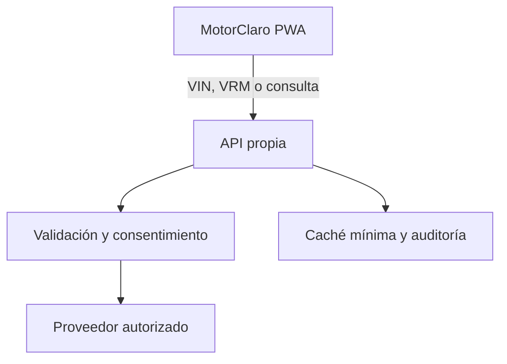

# Integración de datos externos

## Decisión de arquitectura

MotorClaro se publica como sitio estático. Ninguna clave de pago o secreto puede incluirse en JavaScript, porque cualquier visitante podría leerla. La integración profesional debe pasar por un backend propio:



La API propia debe validar entradas, aplicar límites, filtrar la respuesta y no registrar VIN o matrículas salvo que exista una finalidad y retención definidas.

## Proveedores evaluados

| Necesidad | Opción | Uso actual | Observación |
|---|---|---|---|
| Catálogo europeo amplio | TecDoc / TecAlliance | Preparado, no conectado | Producto profesional con contrato; VIN/VRM y datos de vehículo deben consumirse desde backend. |
| VIN básico | NHTSA vPIC | Conectado con respaldo local | Sin clave; útil como apoyo, pero orientado al mercado estadounidense. |
| Matrícula española | Informe de vehículo DGT | Enlace oficial | El usuario realiza la consulta en la sede de la DGT. No se obtiene el titular. |
| OCR de matrícula | Amazon Rekognition | No conectado | Reconoce texto; no aporta por sí solo marca, modelo o motor. Requeriría consentimiento, backend y otra fuente autorizada. |
| Códigos OBD | Base local revisable | Conectado | Los códigos genéricos no bastan: los específicos de fabricante necesitan documentación licenciada. |

## Contrato propuesto para un backend futuro

### `POST /api/vehicles/decode-vin`

Entrada:

```json
{ "vin": "17_CHARACTER_VIN" }
```

Respuesta normalizada:

```json
{
  "make": "Marca",
  "model": "Modelo",
  "year": 2022,
  "engineCode": "Código",
  "fuel": "gasoline",
  "powerKw": 110,
  "source": "provider-name",
  "confidence": "verified"
}
```

### `POST /api/vehicles/decode-registration`

Solo debe habilitarse si el contrato del proveedor cubre matrículas españolas y el tratamiento cumple su base jurídica. Debe devolver datos técnicos mínimos, nunca identidad o domicilio del titular.

## Controles obligatorios

1. Guardar claves únicamente en secretos del servidor.
2. Restringir CORS al dominio publicado.
3. Limitar peticiones por IP/sesión y registrar solo métricas no identificativas.
4. Cifrar conexiones y definir caducidad de caché.
5. Pedir aceptación explícita antes de enviar VIN o matrícula a terceros.
6. Mostrar proveedor, alcance y nivel de verificación en cada resultado.
7. Implementar borrado y exportación si se almacenan consultas.
8. Revisar contrato, RGPD/LOPDGDD y condiciones de la DGT antes de producción.
